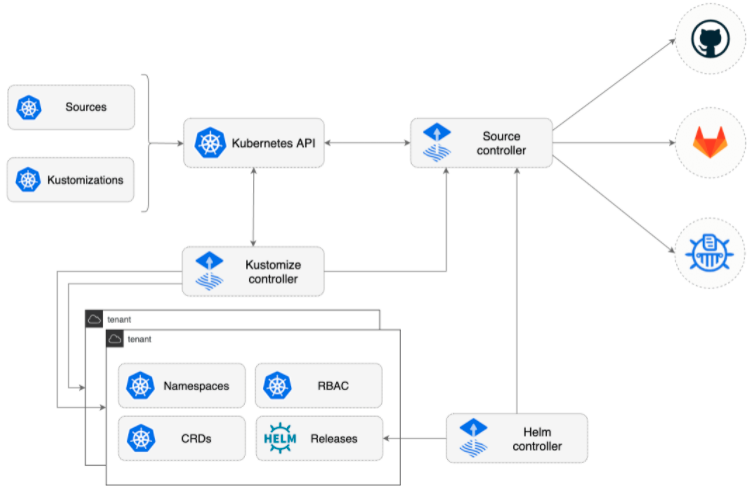

## FluxV2 Architecture



## Install Flux

To install flux-2 in kubernetes cluster, you need to run following command inside flux2 folder

```
helm install flux-system helm/ -n flux-system --create-namespace
```

Verify all pods are in running state by running following command

```
kubectl get po -n flux-system
```

## Connect git repository 

To connect git repository in the system, first you need to create secret with https credentials. run following command and replace secret values

```
kubectl create secret generic git-auth --from-literal username=<user-name> --from-literal password=<password>
```

Once secret is created, apply ```GitRepository``` CR in cluster. run following command

```
kubectl apply -f setup/git-repository.yaml
```

Verfiy that git repository is successfully cloned by typing

```
kubectl get gitrepository 
```

Verify status that its ready. output will be like below:


```
NAME        URL                                                        READY   STATUS                                                              AGE
flux-demo   https://github.com/adeel-ifti/gcp-automation-modules.git   True    Fetched revision: main/1a10189aa2ec3fd7d76c78740699500ab97cd980     52s
```

## Deploy manifest in repository path

Once git repository is connected, create ```Kustomization``` CR to apply yaml manifest in git repository present in ***deploy*** folder by typing following command

```
kubectl apply -f setup/kustomize.yaml
```

verify that resources are successfully applied by running following command

```
kubectl get kustomization
```

status should be something like this:

```
NAME        READY   STATUS                                                            AGE
pod-nginx   True    Applied revision: main/617d6d82d6884060fc2819fcb81afed8eab58bb8   8m44s
```

verify that nginx pod is running in namespace

```
kubectl get po
```